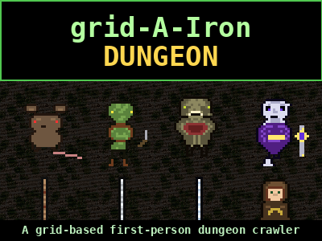

# grid-A-Iron Dungeon



**Play it now:** https://randyhaylor.github.io/grid-a-iron/

A grid-based first-person dungeon crawler ("blobber") in the spirit of
Atari / Intellivision-era D&D titles. Built with three.js in a single
`index.html`. No build step, no framework, mobile-friendly portrait UI.

## Controls

| Action            | Key             | UI                    |
| ----------------- | --------------- | --------------------- |
| Forward / step    | `W` / `↑`       | `↑` button            |
| Backward          | `S` / `↓`       | `↓` button            |
| Turn left  (CCW)  | `A` / `←`       | `↺` button            |
| Turn right (CW)   | `D` / `→`       | `↻` button            |
| Open / Close door | `E`             | `Open Door (E)` button (label flips to `Close Door (E)`) |
| Descend stairs    | `Space`         | `▼` button (pulses green when usable) |
| Take floor item   | `T`             | per-item Take buttons |
| Attack            | `F` (hold to repeat) | `Attack (F)` in combat |
| Run from combat   | `R`             | `Run (R)` in combat   |
| Inventory         | `I`             | `Inventory (I)` button |
| Use Healing Herb  | `H`             | `Use Herb (H)` button (in inventory) |
| Vendor            | `V`             | `Vendor (V)` button (only on vendor cell) |
| Buy first item    | `B` (in vendor) | `Buy (B)` button      |
| Settings          | —               | top-left `☰` hamburger |

## Player & combat

- HP 20 / Wpn (Fists 1-2 dmg by default) / Shld (none by default) / Gold
- Player attack hit chance 75%; enemy hit chance starts at 50% on level 1
  and scales +5% per dungeon level (capped 90%)
- Combat is single-action-per-turn: attack, run (60% success), use a
  Healing Herb, or pick something up — all consume your turn and the
  enemy retaliates. Enemies stay in their rooms and don't chase.

## Items

| Item            | Effect                                       | Source                |
| --------------- | -------------------------------------------- | --------------------- |
| Rusty Sword     | atk 3 (level 1+)                             | one per floor         |
| Iron Sword      | atk 5 (level 4+)                             | one per floor (L4+)   |
| Steel Sword     | atk 7 (level 6+)                             | one per floor (L6+)   |
| Rusty Shield    | DR 1 (level 1+)                              | one per floor         |
| Iron Shield     | DR 2 (level 4+)                              | one per floor (L4+)   |
| Steel Shield    | DR 3 (level 6+)                              | one per floor (L6+)   |
| Healing Herb    | +8 HP (refused at full)                      | floor sprinkle, vendor (5gp), enemy drops |
| Torch           | 75-90 step charges; auto-equipped if none lit | one per floor, vendor (10gp) |
| Gold            | 1gp from weak enemies, 1..lvl from harder    | floor sprinkle, enemy drops |

Player swap rules: only one Wpn and one Shld carried; picking up another
of either drops the previous onto the floor.

## Enemies (level-gated)

| Enemy      | HP | Atk | Min Level |
| ---------- | -- | --- | --------- |
| Giant Rat  | 5  | 2   | 1         |
| Goblin     | 8  | 3   | 1         |
| Slime      | 6  | 2   | 1         |
| Skeleton   | 10 | 4   | 2         |
| Cave Troll | 18 | 6   | 4         |
| Lich       | 30 | 7   | 6         |

Each enemy has a 50-entry random phrase library plus an 8-entry movement
list (red-bordered bubble). 10% of every emission is pulled from a shared
"funny" list ("Mondays, amirite?", "...arrow to the knee...", *dab*).
Vendor NPC has its own friendly green-bordered chatter library and only
spawns on even floors, in the 3x3 around the player's start cell.

## Torches & lighting

- A single torch sprite is held in the left hand at all times when lit
- Each torch lasts 75-90 steps; flickers (held sprite + ambient light)
  when below 10
- Out: BFS visibility collapses to the player's cell only; ambient light
  dims and fog tightens to a fuzzy black border around the room
- A spare torch in inventory auto-relights after a brief darkness
- Walking onto a Torch on the floor while none is lit auto-equips it

## Audio

Music + SFX from `dark_atari_dungeon_mp3_pack_v4_full_music/`:
- 10 mp3 tracks rotated randomly (3-second tail fade-out + 3-8s gap
  between tracks)
- 10-category SFX bank with 4 random variants each: sword swing, damage
  dealt / taken, death sting, descend stairs, door, footstep, gold and
  herb collect, herb take
- Volume sliders in the hamburger settings overlay (defaults: music
  0.125, sfx 0.35)

## HUD

- Top: `Dungeon LVL: N` left-anchored, `HP X/Y` centered (turns red <6)
- Compass dial top-right
- ROOM panel doubles as a discovered-level ASCII map; player arrow
  `^>v<` stays centered and rotates smoothly with facing while the map
  pans under it
- Items show floating green-bordered name labels above their pickups
- Enemy / NPC speech bubbles parented to the scene root (occluded by
  walls, follow the enemy through animations)
- Death sequence: red veil pinned, music fades out, death sting,
  black overlay fades in, "one more skeleton for my army…" message,
  full stats panel, **Play Again (Space)** button

## Project layout

```
index.html                                             # whole game
sprites/                                                # 32x32 sprites + 64x64 textures
  enemy_*.png  item_*.png  npc_vendor.png
  tex_wall_dank_stone.png  tex_floor_dirty_stone.png
  tex_ceiling_dark_stone.png  floor_stairs_down.png
enemies/<name>.json                                    # phrase + movement libraries
npcs/<name>.json                                       # friendly NPC libraries
docs/splash_collage.png                                # README banner / start splash
dark_atari_dungeon_mp3_pack_v4_full_music/            # mp3 audio assets
```

## Run locally

```
python3 -m http.server 8765
# then open http://localhost:8765/
```
